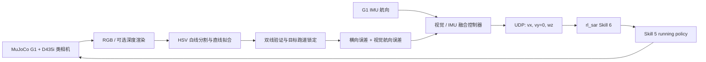

# Unitree G1 视觉自主百米冲刺

[English](README_EN.md) | 中文

基于 **MuJoCo、Unitree G1、D435i 类 RGB-D 相机与强化学习跑步策略**构建的视觉闭环百米冲刺系统。机器人通过机载相机同时识别跑道两侧白线，融合 G1 IMU 航向进行高速纠偏；按下 `6` 后自动起立、进入冲刺状态，并在越过 100 m 终点后平滑减速。

> 当前成果已完成 MuJoCo 仿真验证，尚未声明完成真实 G1 的百米实机验证。


## 项目亮点

- **强化学习运动控制**：复用 [`C1801SYQ/g1_running`](https://github.com/C1801SYQ/g1_running) 的 29 自由度 `running` TorchScript policy，视觉层只输出 `vx / wz`，不直接干预关节力矩。
- **严格双线识别**：基于 RGB 的 HSV 白色分割、形态学处理、连通区域筛选与直线拟合；必须同时检测两条真实边界才更新视觉控制。
- **赛道身份锁定**：使用线对宽度、中心位置和时间连续性约束，避免高速运动时误选相邻跑道。
- **视觉与 IMU 融合**：视觉负责横向位置纠偏，G1 IMU 提供直线航向保持，降低跑步摆动造成的视觉航向噪声。
- **Skill 6 状态机**：保留原 Skill 5 手动跑步状态，新增按键 `6` 的视觉百米状态；从 Passive 按 `6` 会先自动起立，再接管视觉速度命令。
- **完整比赛生命周期**：起跑保护、相机锁线、加速冲刺、100 m 计时、终点后继续巡线减速、自动回到 Passive。
- **工程化联调**：包含 Conda 环境、CycloneDDS、Unitree DDS 桥、MuJoCo 场景生成、启动/停止脚本及单元测试。

## 仿真验证结果

测试场景为蓝色四跑道直道，目标跑道白线中心距 2.1 m（两条 10 cm 白线之间的净宽约 2.0 m），100 m 终点后保留 15 m 减速缓冲区。

| 指标 | 验证结果 |
| --- | ---: |
| 仿真控制段 100 m 用时 | 25.64 s |
| 平均前进速度 | 3.90 m/s |
| 最大速度指令 | 5.10 m/s |
| 双白线有效帧比例 | 98.6% |
| 百米段最大骨盆横向偏移 | 0.559 m |
| 完全停止位置 | 112.05 m |
| 跌倒 / 相邻跑道切换 | 0 / 0 |

以上是 MuJoCo 联合仿真数据，计时从视觉锁线并开始加速时计算，不等同于官方赛事计时结果。

## 系统架构



控制逻辑坚持分层设计：视觉模块只生成机器人速度层命令，稳定跑步和全身关节协调由训练好的 RL policy 完成。

## Skill 6 状态机

```text
按键 6
  └─ Passive → GetUp → VisionSprint100m
                          ├─ 等待机器人稳定
                          ├─ 锁定目标跑道的两条白线
                          ├─ 加速并进行视觉 / IMU 纠偏
                          ├─ 穿过 x = 100 m 后开始减速
                          ├─ 减速期间继续双线纠偏
                          └─ 完全停止 → Passive
```

视觉 UDP 只在 Skill 6 中生效，不会覆盖 Skill 5 的手柄控制。视觉进程超过 300 ms 没有发送新命令时，接收端会强制输出零速度。

## 目录结构

```text
g1_race_vision/
├── g1_race_vision/
│   ├── line_detector.py        # 双白线检测与跑道身份锁定
│   ├── controller.py           # 视觉 / IMU 融合与终点减速控制
│   ├── rendering.py            # MuJoCo RGB-D 渲染
│   └── udp_command.py          # 速度命令发送与看门狗
├── integrations/
│   ├── g1_running/             # rl_sar Skill 6、UDP 接口及可复现补丁
│   └── unitree_rl_mjlab/       # 早期 ONNX 接入参考
├── scripts/
│   ├── prepare_unitree_scene.py
│   ├── run_unitree_camera_sim.py
│   ├── install_g1_running.sh
│   ├── run_vm_full_demo.sh
│   └── start_vm_gui.sh
├── assets/                     # 独立视觉闭环测试场景
├── tests/                      # 检测器、控制器和场景测试
└── docs/PROJECT_INTRO.md       # 求职 / 保研项目介绍模板
```

## 环境要求

- Ubuntu 22.04
- Python 3.11（推荐 Conda）
- MuJoCo Python 3.x
- Unitree `unitree_mujoco`
- Unitree SDK2 / `unitree_sdk2_python`
- CMake、C++17、LibTorch / ONNX Runtime（由 `g1_running` 安装脚本处理）
- 可选：ROS 2 Humble 与 RealSense ROS，用于后续实机相机接入

项目固定使用 `g1_running` 提交：

```text
4d06065aa9445b8af4db5d465fa79f67736e5e36
```

## 安装

### 1. Python 环境

```bash
cd ~/g1_race_vision
conda create -n g1race python=3.11 -y
conda activate g1race
python -m pip install -r requirements.txt
```

### 2. CycloneDDS 与跑步策略

```bash
cd ~/g1_race_vision
bash scripts/install_cyclonedds_runtime.sh
bash scripts/install_g1_running.sh
```

安装脚本会校验固定版本和 `policy.pt` 的 SHA-256，应用 Skill 6 补丁并只编译 G1 控制器。

### 3. 创建启动命令

```bash
install -m 0755 scripts/start_vm_gui.sh ~/start_g1_race.sh
install -m 0755 scripts/stop_vm_gui.sh ~/stop_g1_race.sh
```

## 运行

启动完整 MuJoCo、G1 policy、机器人视角和白线识别：

```bash
bash ~/start_g1_race.sh
```

脚本会自动发送按键 `6`，流程为：

```text
Passive → GetUp → Skill 6 → 双线巡线冲刺 → 100 m 后减速 → Passive
```

再次执行同一命令会自动关闭上一轮已完成的定格窗口并开始新一轮。

停止全部进程：

```bash
bash ~/stop_g1_race.sh
```

查看实时状态：

```bash
tail -f ~/g1_race_run.log
```

## 测试

```bash
cd ~/g1_race_vision
conda activate g1race
python -m unittest discover -s tests -v
```

当前共有 22 项单元测试，覆盖：

- 双线有效性、单线拒绝和相邻跑道防跳变；
- 横向纠偏方向、加减速限幅、视觉丢失保护；
- 终点前保持速度和终点后巡线减速；
- 四跑道、10 cm 白线、100 m 终点和 15 m 缓冲区场景生成。

## 实机迁移思路

`scripts/run_realsense_ros2.py` 提供 RealSense ROS 2 输入接口，可订阅彩色图、对齐深度并复用同一视觉控制器。实机部署前仍需完成：

1. 相机外参、曝光和运动模糊标定；
2. 真机低速架空测试与急停链路验证；
3. 5 m、10 m、20 m、50 m、100 m 分阶段提速；
4. roll / pitch、通信超时和越线风险的独立安全监控；
5. 真实赛场光照、阴影、磨损白线和其他机器人干扰测试。

请勿直接把仿真中的 `5.10 m/s` 指令用于真机首次测试。

## 可展示的技术关键词

`Humanoid Robotics` · `Reinforcement Learning` · `MuJoCo` · `Computer Vision` · `RGB-D` · `Finite-State Machine` · `Sensor Fusion` · `ROS 2` · `Unitree SDK2` · `Sim-to-Real`

## 致谢与引用

- [Unitree Robotics / unitree_mujoco](https://github.com/unitreerobotics/unitree_mujoco)
- [C1801SYQ / g1_running](https://github.com/C1801SYQ/g1_running)
- [MuJoCo Python API](https://mujoco.readthedocs.io/en/stable/python.html)
- [RealSense ROS](https://github.com/realsenseai/realsense-ros)

本仓库不重复分发 Unitree 官方仓库或 `g1_running` 的完整第三方依赖，仅保存集成代码、固定版本信息和可复现补丁。使用第三方组件时请遵守其各自许可证。
