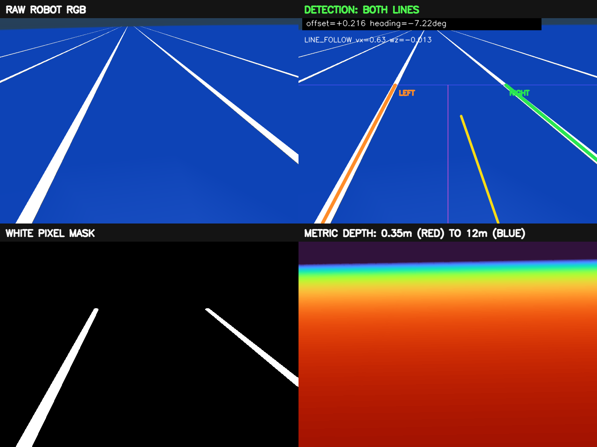

# Unitree G1 视觉自主百米冲刺（Skill 6）

这是 `g1_running` 的增量视觉扩展。原有 `robot_rl` 训练框架、29 自由度模型、`rl_sar`、Skill 5 跑步状态和全部策略文件保持不变；本目录新增 D435i 类 RGB-D 相机、双白线识别、视觉/IMU 纠偏和 100 m 比赛状态机。

视觉模块由 [MS-handsome6](https://github.com/MS-handsome6) 贡献，并在本仓库中持续维护。

> 当前完成的是 MuJoCo 联合仿真验证，尚未声明完成真实 G1 百米实机验证。



## 功能

- 蓝色四跑道直道；目标赛道两条白线中心距 2.1 m，白线各宽 0.10 m，因此两线内侧净宽为 2.0 m。
- RGB 图像经 HSV 白色分割、形态学处理、连通区域筛选和直线拟合，同时识别目标跑道两侧白线。
- 只有两条边界线同时有效时才更新视觉纠偏，利用线对宽度、中心和时间连续性锁定目标跑道，避免误跟相邻跑道。
- 视觉负责横向位置，G1 IMU 负责航向保持；控制器仅输出 `vx / vy=0 / wz`，不直接生成关节力矩。
- 新增 Skill 6：必须先按 `0` 起立、按 `1` 进入稳定站立/运动状态，再按 `6` 进入视觉冲刺；按 `6` 不会自动起立。原 Skill 5 和按键 `5` 保持不变。
- 越过 100 m 后继续巡线并平滑减速，视觉 UDP 超过 300 ms 无新数据时强制输出零速度。

## 控制结构

```text
MuJoCo G1 + D435i 类 RGB-D 相机
                │
                ▼
       双白线检测与目标跑道锁定 ──┐
                                ├─► 视觉/IMU 控制器
                    G1 IMU ─────┘         │
                                         ▼
                               UDP: vx, vy=0, wz
                                         │
                                         ▼
                            rl_sar Skill 6 状态机
                                         │
                                         ▼
                           原 Skill 5 running policy
```

Skill 6 复用原仓库的 `rl_sar/policy/g1/running/policy.pt`。视觉模式关闭时，UDP 接收器不会覆盖手柄/键盘速度，因此原有运行方式仍然有效。

## 目录

```text
vision/
├── line_detector.py           # 双白线识别与跑道身份锁定
├── controller.py              # 视觉/IMU 融合、加速与终点减速
├── rendering.py               # MuJoCo RGB-D 渲染
├── udp_command.py             # 速度指令发送
├── scripts/
│   ├── activate_g1race_dds.sh # 激活 g1race 并统一 DDS 配置
│   ├── install_g1_running.sh  # 应用 rl_sar 集成补丁并首次编译
│   ├── build_skill6.sh        # 只重编译 rl_real_g1，不改原 policy
│   ├── prepare_unitree_scene.py
│   ├── run_unitree_camera_sim.py
│   ├── run_vm_full_demo.sh
│   ├── start_vm_gui.sh
│   └── stop_vm_gui.sh
├── environment.yml            # 可复现的 g1race Conda 环境
├── assets/                    # 独立视觉闭环场景与截图
├── tests/                     # 27 项单元测试
└── integrations/
    ├── g1_running/            # rl_sar C++ 集成补丁
    └── unitree_rl_mjlab/      # 早期 ONNX 接入参考
```

Skill 6 的 C++ 接口和状态机改动保存在 `vision/integrations/g1_running/`。
`install_g1_running.sh` 会把这些增量补丁应用到固定版本的 `g1_running`，
不会覆盖仓库中与视觉冲刺无关的训练代码和策略文件。

## 环境

- Ubuntu 22.04
- Python 3.11（推荐 Conda；Anaconda 和 Miniconda 均可）
- MuJoCo Python 3.x
- Unitree `unitree_mujoco`
- Unitree SDK2 / `unitree_sdk2_python`
- CMake、C++17、LibTorch / ONNX Runtime
- 可选：ROS 2 Humble 与 RealSense ROS，用于实机相机接入

## 安装

在本仓库根目录创建名为 `g1race` 的环境：

```bash
conda env create -f vision/environment.yml
conda activate g1race
```

如果 `g1race` 已经存在，则更新它，不需要删除重装：

```bash
conda env update -n g1race -f vision/environment.yml
```

`unitree_sdk2_python` 仍按 `unitree_mujoco` 官方说明安装到同一个 `g1race` 环境中。

安装与 Unitree SDK2 Python 匹配的 CycloneDDS 运行库：

```bash
bash vision/scripts/install_cyclonedds_runtime.sh
```

每次新开终端后，可用下面一条命令同时激活 `g1race` 和本项目的 DDS 配置：

```bash
source vision/scripts/activate_g1race_dds.sh
```

它固定使用 CycloneDDS `0.10.2`、DDS domain `0`、回环网卡 `lo`，并关闭共享内存传输，保证 Python `unitree_mujoco` 桥和 C++ `rl_sar` 使用同一套 DDS 配置。完整启动脚本也会自动执行这一步。

首次安装集成补丁并编译包含 Skill 5 和 Skill 6 的 G1 控制器：

```bash
bash vision/scripts/install_g1_running.sh
```

如果补丁已经安装，只需重新编译控制器：

```bash
bash vision/scripts/build_skill6.sh
```

两个脚本都会校验原 `running` policy 的 SHA-256；不会替换或修改原策略。

## 运行

先确保 `unitree_mujoco` 位于 `~/unitree_ws/unitree_mujoco`，然后在仓库根目录的 Ubuntu 终端执行：

```bash
bash vision/scripts/run_vm_full_demo.sh
```

脚本会打开 MuJoCo 主视角和机器人 RGB-D 视角，并把当前终端保留为 `rl_sar` 键盘控制终端。鼠标可以点击 MuJoCo 窗口查看画面，但按键必须输入到启动命令所在的终端。

严格按下面顺序操作：

1. 启动后控制器处于 `Passive`。在 `rl_sar` 终端按 `0`，进入 `GetUp` 起立过程。
2. 等机器人完全站稳后，在同一终端按 `1`，进入状态 1 `RLFSMStateRLRoboMimicLocomotion`。零速度指令下机器人会保持站立。
3. 确认状态 1 稳定后，在同一终端按 `6`，进入视觉百米冲刺 `Skill 6`。

```text
启动 MuJoCo/DDS → Passive ──0──> GetUp ──1──> 状态 1 ──6──> Skill 6
                                                           │
                              双线巡线冲刺 ←────────────────┘
```

`6` 只在状态 1 有效；从 Passive、GetUp、GetDown 或 Skill 5 按 `6` 都不会启动 Skill 6，也不会自动起立。

停止全部进程：回到 `rl_sar` 控制终端按 `Ctrl+C`。兼容入口 `start_vm_gui.sh` 也改为相同的前台交互模式：

```bash
bash vision/scripts/start_vm_gui.sh
```

如需手动指定依赖位置：

```bash
UNITREE_ROOT=~/unitree_ws \
G1_RUNNING_ROOT="$PWD" \
bash vision/scripts/run_vm_full_demo.sh
```

## 测试

```bash
conda activate g1race
cd vision
python -m unittest discover -s tests -v
```

27 项测试覆盖严格双线模式、单线拒绝、相邻跑道防跳变、纠偏方向、速度限幅、视觉丢失保护、终点减速、四跑道/10 cm 白线/100 m 终点场景生成，以及 Skill 6 只能从状态 1 进入、启动器不再自动发送按键 `6`、虚拟机分离目录启动入口。

## 仿真结果

| 指标 | 联合仿真结果 |
| --- | ---: |
| 仿真控制段 100 m 用时 | 25.69 s |
| 平均前进速度 | 3.89 m/s |
| 最大速度指令 | 5.10 m/s |
| 双白线有效帧比例 | 98.7% |
| 百米段最大骨盆横向偏移 | 0.242 m |
| 完全停止位置 | 111.49 m |
| 跌倒 / 相邻跑道切换 | 0 / 0 |

这些是按照 `Passive → 0 → GetUp → 1 → 状态 1 → 6 → Skill 6` 流程完成的 MuJoCo 联合仿真数据，计时从视觉锁线并开始加速时计算，不等同于官方赛事计时结果。

## 实机迁移

`scripts/run_realsense_ros2.py` 可订阅 RealSense ROS 2 彩色图与对齐深度，并复用相同控制器。真机首次测试不能直接使用 5.10 m/s，应先完成相机外参/曝光标定、架空测试和急停验证，再按 5 m、10 m、20 m、50 m、100 m 分阶段提速，并增加 roll/pitch、通信超时和越线风险的独立安全监控。

## 参考

- [Unitree Robotics / unitree_mujoco](https://github.com/unitreerobotics/unitree_mujoco)
- [MuJoCo Python API](https://mujoco.readthedocs.io/en/stable/python.html)
- [RealSense ROS](https://github.com/realsenseai/realsense-ros)
