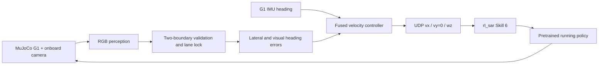

# Vision-Guided 100 m Sprint for Unitree G1

[中文](README.md) | English

A closed-loop 100 m sprint stack for the **29-DoF Unitree G1**, integrating MuJoCo, a D435i-like onboard camera, strict two-boundary lane perception, IMU heading fusion, an `rl_sar` finite-state machine, and a pretrained reinforcement-learning running policy.

> The current results are validated in MuJoCo simulation. This repository does not claim a completed 100 m run on physical G1 hardware.


## Highlights

- Reuses the [`C1801SYQ/g1_running`](https://github.com/C1801SYQ/g1_running) 29-DoF TorchScript running policy while keeping perception and joint control separated.
- Detects two real white lane boundaries using exposure-adaptive segmentation, local contrast, motion-blur-aware morphology, and robust Huber line fitting.
- Locks the selected lane using width, center, and temporal-continuity constraints to reject adjacent lanes.
- Refits fragmented boundaries from real pixels near the locked pair and separates common camera shake from lane-shape changes; it never invents a missing second line.
- Fuses visual lateral error with G1 IMU heading feedback for high-speed steering.
- Adds an isolated **Skill 6** to `rl_sar`: state-1-only entry, lane lock, sprint, timed 100 m crossing, visually guided deceleration, and automatic return to Passive.
- Includes watchdog behavior, fall detection, repeatable scene generation, launch scripts, and 35 unit tests.

## Simulation Result

| Metric | Result |
| --- | ---: |
| Simulated 100 m control time | 25.64 s |
| Average forward speed | 3.90 m/s |
| Maximum velocity command | 5.10 m/s |
| Valid two-line frame ratio | 98.6% |
| Maximum pelvis lateral deviation | 0.559 m |
| Full stop position | 112.05 m |
| Falls / adjacent-lane switches | 0 / 0 |

Timing starts when the final-height camera locks the lane and acceleration begins; it is not an official competition result.

## Architecture



## Quick Start

Requirements include Ubuntu 22.04, Python 3.11, MuJoCo 3.x, Unitree SDK2, `unitree_sdk2_python`, and `unitree_mujoco`.

```bash
cd ~/g1_race_vision
conda create -n g1race python=3.11 -y
conda activate g1race
python -m pip install -r requirements.txt

bash scripts/install_cyclonedds_runtime.sh
bash scripts/install_g1_running.sh

install -m 0755 scripts/start_vm_gui.sh ~/start_g1_race.sh
install -m 0755 scripts/stop_vm_gui.sh ~/stop_g1_race.sh
bash ~/start_g1_race.sh
```

After launch, send the keys in the `rl_sar` controller terminal in this order:

```text
Passive --0--> GetUp --1--> state 1 --6--> Skill 6
                                          └--> visual sprint → post-finish deceleration → Passive
```

Key `6` is accepted only from state 1 and never performs an automatic stand-up.

Stop all processes with:

```bash
bash ~/stop_g1_race.sh
```

## Tests

```bash
conda activate g1race
python -m unittest discover -s tests -v
```

The 35 tests cover lane-pair validation, strict single-line rejection, low light and color cast, abrupt exposure changes, motion blur, camera shake, fragmented-line refitting, adjacent-lane rejection, steering direction, acceleration limits, perception dropout, post-finish visual braking, race-scene geometry, and the Skill 6 startup handshake.

## Sim-to-Real Status

`scripts/run_realsense_ros2.py` provides a RealSense ROS 2 input path that reuses the same controller. Physical deployment still requires camera calibration, exposure and motion-blur testing, an independent emergency-stop chain, low-speed staged validation, and real-track robustness evaluation.

Do not apply the simulated `5.10 m/s` command directly during initial hardware testing.

## Acknowledgements

- [Unitree Robotics / unitree_mujoco](https://github.com/unitreerobotics/unitree_mujoco)
- [C1801SYQ / g1_running](https://github.com/C1801SYQ/g1_running)
- [MuJoCo Python API](https://mujoco.readthedocs.io/en/stable/python.html)
- [RealSense ROS](https://github.com/realsenseai/realsense-ros)

This repository stores integration code and reproducible patches, but does not redistribute complete third-party repositories or their policy binaries. Follow each upstream project's license when installing dependencies.
