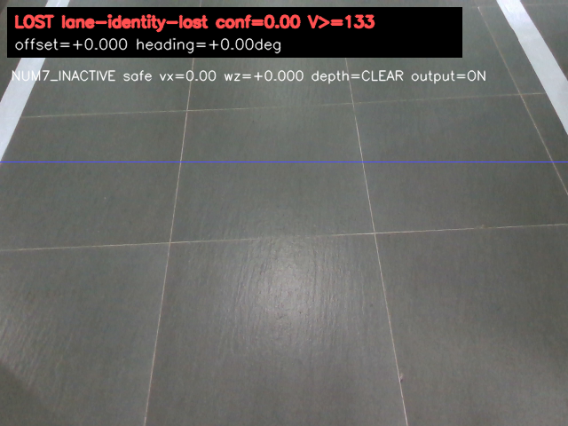
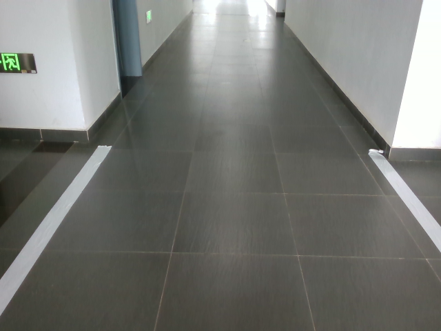
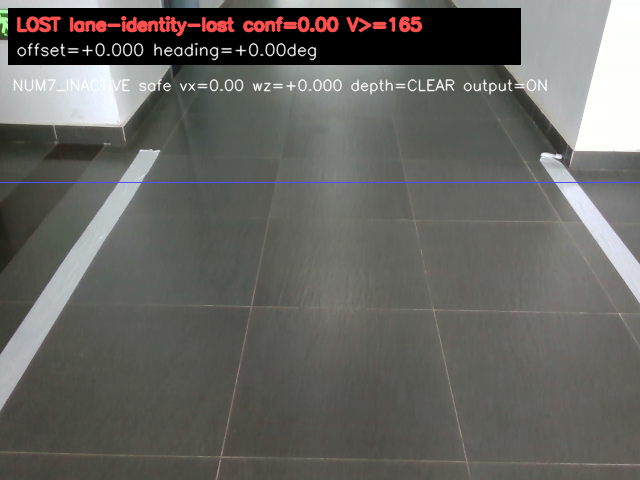
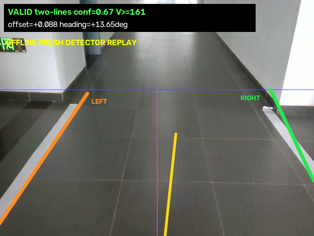

# Skill 7 真机白线视觉审计

## 结论

本目录保存 2026-08-12 在 G1 + D435i 上采集的现场证据。当前 Skill 7
代码可以完成状态握手、白线控制命令输出、深度安全、UDP watchdog 和 1 m
开环停止。现场采集时还存在一个必须优先修复的生命周期问题：

> 审计时的 `run_realsense_ros2.py` 在 Num7 再次激活时重置了 controller 和距离
> gate，但没有重置 `WhiteLaneDetector`。该问题现已修复：状态线程只排队模式
> 边沿，由相机回调线程在每次真实上升沿同步重置 detector、controller 和距离 gate；
> 500 ms 心跳不会重复重置。

本目录继续保留修复前的现场证据用于回归对照。生命周期 P0 已完成代码和单元测试，
但在完成真机图像回放及吊起验证前，仍不应把当前版本标记为视觉真机验收完成。

## 现场运行现象

控制器成功进入 Num7，UDP 端口和限速均正常：

```text
[vision] velocity receiver listening on 127.0.0.1:15001,
         timeout=300 ms, max_vx=0.5, max_wz=0.25
[vision] command mode -> WALK0P5M
[NOTE] Skill 7 entered: 1.0 m vision walk
[vision] first velocity command received; vision override is active
[skill7] stop latched: START_TIMEOUT_NO_FORWARD_CMD
```

同期 ROS 诊断为：

```text
depth_safety.message=CLEAR
motion_allowed=True
speed_scale=1.000
valid_fraction=1.000
desired_cmd_vel.linear.x=0.0
safe_cmd_vel.linear.x=0.0
```

因此停止原因不是 UDP 断链，也不是深度安全拒绝，而是 detector 没有给出有效
双线结果，Python 只能持续发送零速度。C++ 在 2 秒内收不到正向安全速度后按设计
触发 `START_TIMEOUT_NO_FORWARD_CMD`。

## 图片清单

| 文件 | 类型 | 说明 |
|---|---|---|
| [01_initial_lane_ends_at_roi.png](images/01_initial_lane_ends_at_roi.png) | 真机调试图 | 初始摆位，两条白线在紫色 ROI 边界附近结束，近场无有效线段，运行节点为 `LOST lane-identity-lost`。 |
| [02_lane_visible_but_outside_near_field.png](images/02_lane_visible_but_outside_near_field.png) | 真机调试图 | 白线肉眼可见，但在画面下部越出左右边缘，运行节点为 `LOST none`。 |
| [03_repositioned_still_lost.png](images/03_repositioned_still_lost.png) | 真机调试图 | 调整位置后白线仍主要处于远场，运行节点继续输出零速度。 |
| [04_current_raw_white_lane.png](images/04_current_raw_white_lane.png) | 真机原始彩色图 | 最新 D435i 原始白线画面，无调试叠加。 |
| [05_current_white_mask.png](images/05_current_white_mask.png) | 离线二值图 | 对 04 使用当前 `_build_white_mask` 和形态学处理得到的白色候选 mask。 |
| [06_runtime_lane_identity_lost.png](images/06_runtime_lane_identity_lost.png) | 真机调试图 | 常驻节点在当前有效场景仍锁存 `LOST lane-identity-lost`。 |
| [07_simulation_dashboard_reference.png](images/07_simulation_dashboard_reference.png) | 仿真参考 | Num7 仿真 dashboard，仅用于与真机视角对比，不能作为真机检测证据。 |
| [08_same_frame_fresh_detector_valid.png](images/08_same_frame_fresh_detector_valid.png) | 离线复算图 | 对 04 创建全新的 `WhiteLaneDetector` 后立即得到 `VALID two-lines`。 |

### 初始 ROI 问题



### 最新原始白线画面



### 常驻节点仍锁存失败



### 同一原始帧使用全新 detector 可识别



## 同帧离线复算数据

对 `04_current_raw_white_lane.png` 使用仓库当前 `WhiteLaneDetector()` 进行一次全新
实例离线复算：

```text
image_size=640x480
roi_y=182
lookahead_y=271
geometry_bottom_y=367
adaptive_value_threshold=161
white_mask_pixels=16801

left_candidate:
  slope=-0.679
  score=0.744
  vertical_span=270 px
  x_at_lookahead=122.5
  x_at_bottom=57.3

right_candidate:
  slope=+0.472
  score=0.593
  vertical_span=185 px
  x_at_lookahead=593.4
  x_at_bottom=638.8

pair:
  bottom_width=581.5 px
  top_width=470.9 px
  center=348.0 px
  center_offset=28.0 px

result:
  valid=True
  source=two-lines
  confidence=0.668494
  lateral_error=+0.087598
  heading_error_rad=+0.238234
```

当前配置允许的近场宽度为 128–608 px，初始中心偏移上限为 115.2 px。因此这张
原始帧通过现有分割和几何门限。运行节点在相同现场姿态仍返回
`lane-identity-lost`，说明首要问题不是白色阈值，而是 detector 跨任务保留状态。

## 需要完成的视觉优化

### P0（已完成代码修复）：Num7 detector 生命周期

涉及位置：`vision/scripts/run_realsense_ros2.py::_status_loop`。

旧版 `NONE -> WALK0P5M` 只执行：

```python
self.walk_gate.activate(...)
self.controller.reset()
```

当前已把 detector 当作同一个任务会话的状态机管理：

1. 只在一次真实的 `NONE -> WALK0P5M` 上升沿重置 detector。
2. 同时重置 controller、距离 gate、lane anchor、boundary breach counter、
   lateral reference 和 `lane_identity_lost`。
3. 500 ms 的 C++ enable heartbeat 不得反复重置 detector。
4. 状态监听线程不能直接与图像回调并发修改 detector；使用锁、事件队列，或让
   reset 在 ROS executor 所在线程执行。
5. disable 后保持零命令并清理会话；下一次 enable 必须能够重新锁线。

验收标准：

- 人为触发 `lane-identity-lost` 后发送 disable，再次 enable，在有效双线画面下
  1 秒内恢复 `VALID`。
- 连续 heartbeat 不改变已锁定的 lane anchor，不重置距离任务。
- 快速 `WALK -> NONE -> WALK` 保留两个有效生命周期转换。
- 增加单元测试和真实 ROS 回放测试，覆盖 detector 锁存后的第二次 Num7。

### P0：增加“视觉就绪”握手，消除按键后的盲等窗口

目前按 `7` 后 C++ 立即开始 2 秒 start timeout；Python 可能仍在等待首个有效双线
结果。建议增加独立的 ready 状态，例如满足以下条件连续 N 帧后才报告 ready：

- 两条边界均有效；
- confidence 高于标定阈值；
- 深度状态为 `CLEAR` 或允许运动；
- 图像与深度时间戳新鲜；
- lane center 和 heading 处于起步窗口。

C++ 应区分：

- 没有任何 UDP 包；
- Python 在线但正在等待白线；
- Python 已 ready，但没有正向命令；
- Python hard stop。

不要简单增大 `G1_NUM7_START_TIMEOUT_S`。增大超时只会掩盖未锁线问题，不能证明
视觉已经安全就绪。

### P1：输出明确的拒绝原因和候选几何

当前 `source=none` 无法判断具体失败门限。调试信息至少应发布：

- 白色候选连通域数量；
- 每条候选的面积、垂直跨度、拟合残差和上下端点；
- pair 的 near/far width、center offset、heading；
- 被拒绝的具体规则，如 `SPAN_TOO_SHORT`、`WIDTH_TOO_LARGE`、
  `CENTER_OFFSET`、`ANCHOR_MISMATCH`、`HEADING_LIMIT`；
- 当前是否已锁存 lane identity，以及锁存的触发计数。

建议把这些字段发布到 ROS diagnostic topic，并继续叠加到 debug image，便于真机
调参时直接判断问题，不再只看到 `LOST none`。

### P1：改进靠近图像边缘时的双线几何

现场白线经常在近场越出左右画面。建议：

1. 使用两条线共同可见的最高有效采样行计算 lane width，不要固定依赖某一
   `bottom_y` 外推。
2. 对被图像边缘截断的 contour 增加 `clipped_by_border` 标志，降低置信度但不要
   直接与完整 contour 等价处理。
3. 初始锁线仍必须要求真实双线，不建议直接合成缺失边界。
4. 通过相机内参与地面单应性/IPM，把图像宽度门限换成地面坐标下的车道宽度和
   横向偏差，减少相机俯仰、安装高度和透视造成的固定像素门限漂移。
5. 使用现场录制数据回放寻找 ROI、跨度和宽度的统计分布，再确定参数，避免只用
   合成图调参。

### P1：相机安装与标定

- 固定 D435i 俯角、安装高度和横向偏移，并记录标定值。
- 使用实际安装姿态重新确定 ROI，而不是依赖机器人摆位去适配固定 ROI。
- 锁线时记录初始 lateral/heading reference，但只允许在任务上升沿建立一次。
- 评估自动曝光变化；当前现场自适应阈值约为 161，白色 mask 已完整，因此曝光
  不是本次失败主因，但仍需覆盖背光、阴影和反光地砖。

### P2：建立真机图像回放回归集

将本目录图像加入回放测试，并继续采集：

- 正确居中、左偏、右偏；
- 白线靠近左右边缘；
- 一条线短暂遮挡；
- 强反光、暗光、阴影；
- D435i 帧短暂丢失；
- 第一次任务失败后第二次 Num7；
- 机器人步态引起的俯仰和滚转。

至少分别统计初始锁线召回率、误锁相邻赛道率、运行中丢线率、恢复时间和 hard
stop 延迟。安全相关测试应坚持“错误时停”，不能为了提高召回率而允许单线长期
推算。

## 建议实施顺序

1. 用本目录图片做离线回放，确认第二次 Num7 能重新锁线。
2. 增加视觉 ready 握手和具体 stop reason。
3. 吊起机器人进行两次连续 Num7，仅验证命令产生与停止，不落地。
4. 完成相机安装标定和边缘截断几何优化。
5. 依次进行 0.10 m、0.25 m、0.50 m、1.00 m 地面测试并人工测量。

## 当前安全边界

- 1 m 停止仍是速度命令积分乘 `distance_scale`，不是可靠里程计闭环。
- `control_transfer returned error: Resource temporarily unavailable` 在现场仍偶发；
  15 FPS 配置下未观察到本轮 streamer watchdog，但应继续记录 USB 稳定性。
- 修复前证据支持“深度安全正常、分割可用、生命周期曾有缺陷”；修复后的真机回归
  尚未完成，因此仍不支持直接放宽所有白线几何门限。
